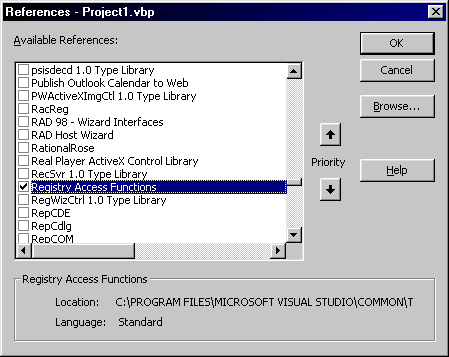



## An Amazingly Simple Way to Read/Write Registry Entries

### Description

This is the simplest way of reading and writing to the registry with the least amount of code...bar none! Don't bother with the Windows API to perform simple Read/Write/Delete in the registry! Just set a reference to "Registry Access Functions" (RegTool5.dll) in Project | References. It can be found in C:\Program Files\Microsoft Visual Studio\Common\Tools\APE. Press F2 to view the Object Browser and see the wonderful functions already there for you!
 
### More Info
 

             |
---                |---
**Submitted On**   |2001-12-10 13:12:56
**By**             |[Jason Butera](https://github.com/Planet-Source-Code/PSCIndex/blob/master/ByAuthor/jason-butera.md)
**Level**          |Intermediate
**User Rating**    |4.5 (45 globes from 10 users)
**Compatibility**  |VB 5\.0, VB 6\.0
**Category**       |[Registry](https://github.com/Planet-Source-Code/PSCIndex/blob/master/ByCategory/registry__1-36.md)
**World**          |[Visual Basic](https://github.com/Planet-Source-Code/PSCIndex/blob/master/ByWorld/visual-basic.md)
**Archive File**   |[An\_Amazing4121312112001\.zip](https://github.com/Planet-Source-Code/jason-butera-an-amazingly-simple-way-to-read-write-registry-entries__1-29640/archive/master.zip)

